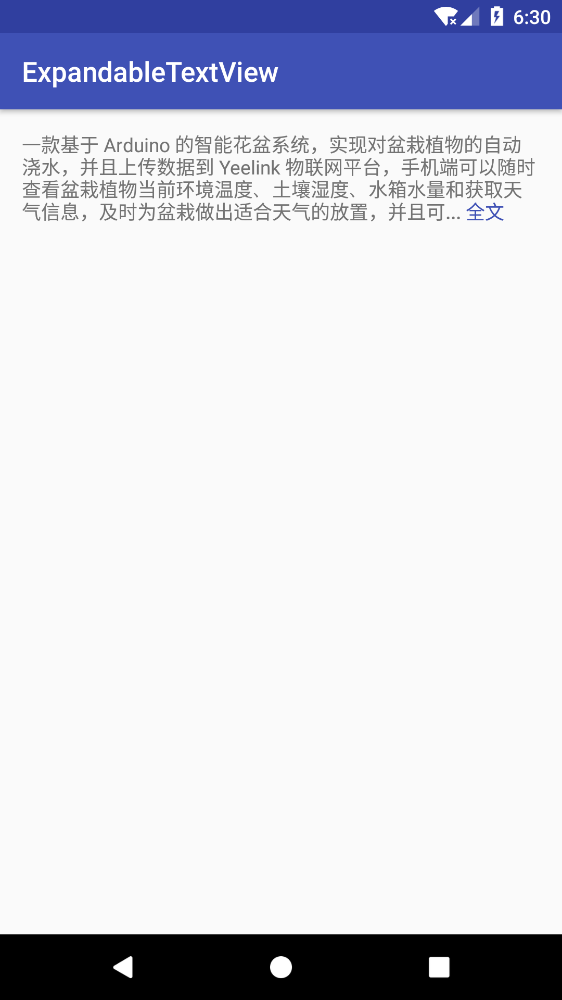
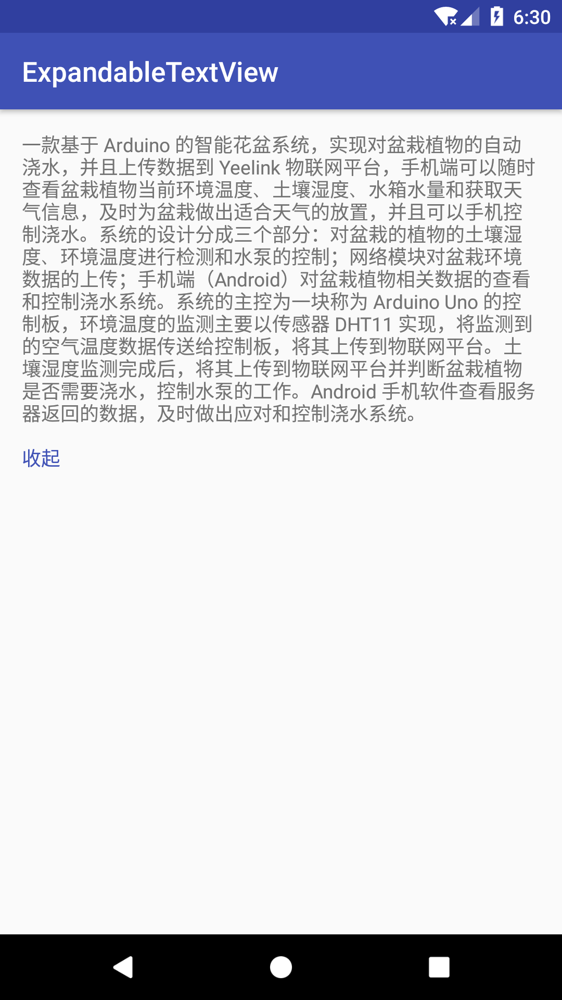

# AutoSizeTextView

## xml attribute

xml attribute | description  
--- | ---
etv_rows | (integer) 折叠时文字行数
etv_notice_underline | (boolean) 提示文字是否有下划线
etv_notice_text_Color | (color) 提示文字颜色
etv_expand_notice | (string) 展开时提示文字
etv_collapse_notice | (string) 折叠时提示文字

## TODO

- [ ] 文本内容左右对齐
